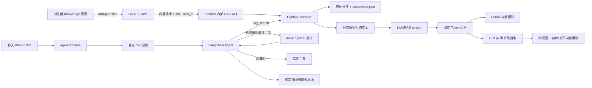
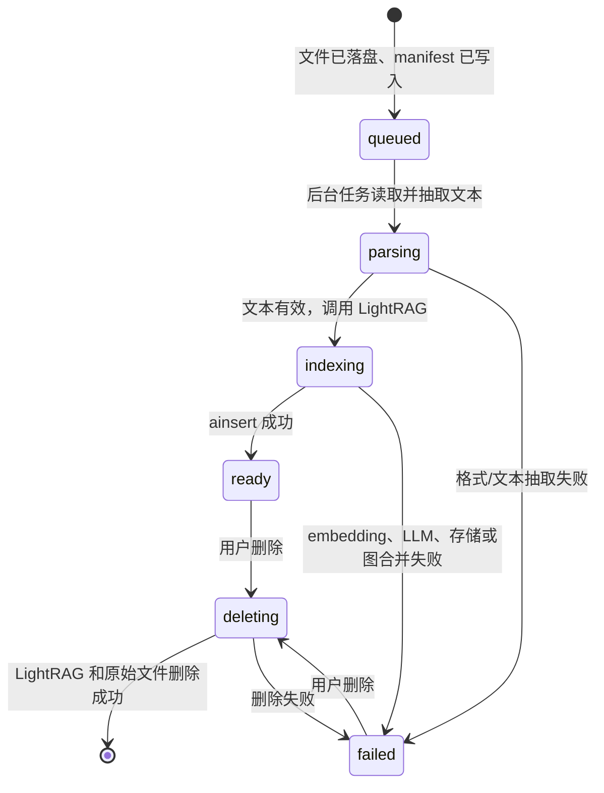
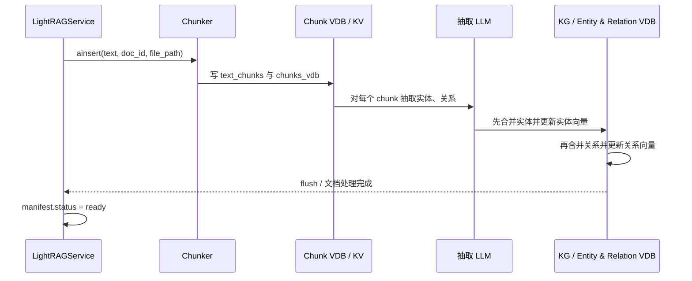
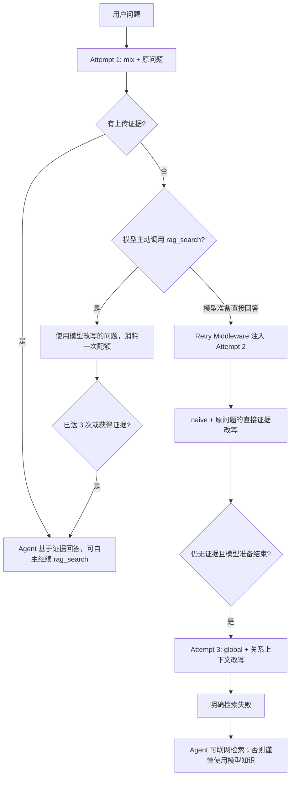

# SuperAssist LightRAG 技术设计

## 1. 目的与边界

本目录实现的是“用户上传资料”的检索增强生成（RAG）能力。它使用
[`lightrag-hku`](https://github.com/HKUDS/LightRAG) 1.5.4 的 SDK，将文档同时
索引为文本向量和实体关系图，再由聊天 Agent 决定如何继续检索、联网或谨慎
使用模型知识。

它不是 `superassist.memory`：

| 系统 | 数据来源 | 主要用途 | 存储位置 |
| --- | --- | --- | --- |
| 长期记忆图 | 对话、工具事件、用户偏好 | 跨轮对话记忆 | `.superassist/superassist.sqlite3`、`.superassist/faiss/` |
| LightRAG 知识图 | 用户上传的文件 | 针对文件内容的可追溯问答 | `.superassist/rag/<user-hash>/` |

两套图互不写入、互不检索。长期记忆可以影响聊天上下文；LightRAG 的证据仅在
该轮开启 RAG 模式时加入上下文。

## 2. 总体架构



责任划分如下：

- `documents.py`：安全文件名、格式识别和文本抽取。
- `service.py`：用户隔离、文档清单、后台索引/删除、LightRAG 生命周期和结构化检索。
- `context.py`：一轮聊天内的检索配额、查询轨迹和来源集合。
- `tools.py`：暴露给 Agent 的 `rag_search` 工具。
- `middlewares/` 中的三个 `rag_*_middleware.py`：首轮检索、失败兜底重试和回答来源标注。
- `ui/rag.py`：Python 内部上传、列表、删除 API。
- `go-server/handler/rag.go`：基于 JWT 用户 ID 的公开 API 代理。

## 3. 数据隔离与目录

`LightRAGService` 对每个用户计算 `sha256(user_id)` 的前 24 位，绝不直接使用
用户输入作为目录名。一个用户的目录大致如下：

```text
.superassist/
  rag/
    9bbf17488ebfc5c989c9ebd8/       # sha256(user_id)[:24]
      documents.json                 # SuperAssist 文档清单和状态
      files/
        doc-<uuid>.pdf               # 原始文件；文件名不对外暴露
      index/
        default/                     # LightRAG workspace="default"
          graph_chunk_entity_relation.graphml
          vdb_chunks.json
          vdb_entities.json
          vdb_relationships.json
          ... JSON KV 与文档状态文件
```

具体 LightRAG 文件名会随上游小版本和存储后端变化；代码不得依赖这些文件名。
当前构造函数明确使用 LightRAG 的默认本地存储实现：

| 数据类别 | LightRAG 默认实现 | 内容 |
| --- | --- | --- |
| 键值数据 | `JsonKVStorage` | 原文、切片、实体、关系、LLM 缓存 |
| 向量数据 | `NanoVectorDBStorage` | chunk、实体、关系的 embedding |
| 图数据 | `NetworkXStorage` | 实体节点和关系边，持久化为 GraphML |
| 文档状态 | `JsonDocStatusStorage` | LightRAG 内部文档处理状态和 chunk 列表 |

浏览器不会传递 `user_id`。公开 `/api/rag/*` 路由由 Go 的 JWT 中间件取得用户 ID，
再传给 Python 内部 `/internal/rag/*?user_id=...`。因此，前端参数无法选择其他用户
的知识库。

## 4. 上传与文本抽取

### 4.1 上传契约

公开接口由 Go 提供：

| 方法 | 路径 | 含义 |
| --- | --- | --- |
| `GET` | `/api/rag/documents` | 获取当前用户文件、限制和可接受扩展名 |
| `POST` | `/api/rag/documents` | `multipart/form-data`，字段名为 `files`，可批量上传 |
| `DELETE` | `/api/rag/documents/:id` | 异步删除一份文档及其 LightRAG 派生数据 |

Python 接口立即返回 `202 Accepted`，不等待 LLM 抽取结束。Knowledge 页面在存在
待处理项目时每 2.5 秒轮询一次列表。

当前支持的扩展名：`.txt`、`.md`、`.json`、`.csv`、`.html`、`.htm`、`.pdf`、
`.docx`、`.pptx`、`.xlsx`。

上传保护：

- Python 对每个文件限制 `SUPERASSIST_RAG_MAX_FILE_SIZE_MB`，默认 25 MB。
- 一个请求最多 `SUPERASSIST_RAG_MAX_FILES_PER_BATCH` 个文件，默认 20。
- Go 代理还设置了 512 MiB HTTP Body 硬上限，覆盖默认批量上限约 500 MB 的场景。
- `safe_filename()` 去除路径、控制字符和 Windows 非法字符；原始保存名使用随机
  `doc-<uuid>.<ext>`。
- 空文件、无扩展名和不支持类型会被拒绝。

这不是恶意文件扫描。当前实现不做病毒扫描、PDF OCR、宏检测或 MIME 内容真实性
校验；对不可信上传环境，应在反向代理或独立文件服务增加这些能力。

### 4.2 各格式如何转为文本

| 格式 | 实现 | 说明 |
| --- | --- | --- |
| TXT / Markdown | `_read_text` | 依次尝试 UTF-8 BOM、GB18030、UTF-16，最后 UTF-8 replace |
| JSON | `json.loads` 后格式化 | 无效 JSON 直接失败，不作为普通文本吞掉 |
| CSV | `csv.reader` | 每行拼为 `cell1 | cell2 | ...` |
| HTML | `HTMLParser` | 忽略 `script/style/noscript`，保留可见文本 |
| PDF | `pypdf.PdfReader` | 串接每页 `extract_text()` 结果；扫描件通常无可用文字 |
| DOCX | `python-docx` | 段落和表格行，表格单元格使用 ` | ` 连接 |
| PPTX | `python-pptx` | 逐页读取具有 `text` 属性的形状 |
| XLSX | `openpyxl` 只读模式 | 输出 sheet 名和每一个非空行 |

抽取文本去掉首尾空白后少于 10 个字符会失败。图片、图表的视觉语义不会被理解，
除非原文件已经包含可抽取的文本层。

### 4.3 SuperAssist 文档状态机



`documents.json` 的内部记录包含 `id`、用户可见 `name`、内部 `storage_name`、
`size`、`status`、`error`、`characters`、`created_at`、`updated_at`。对外 API 会
去掉 `storage_name`。

manifest 使用进程内 `RLock` 和“写临时文件后 replace”的方式更新。它不是多进程
分布式事务；同一数据目录被多个 AI Engine 进程同时写入时，需要外部单写者约束或
替换为数据库。

## 5. 建库、切片与向量化

### 5.1 为什么有专用 asyncio 线程

LangGraph Agent 的主运行路径是同步调用，而 LightRAG 的存储锁、队列和 SDK API 是
异步且与事件循环绑定的。`LightRAGService` 启动一个名为
`superassist-lightrag` 的专用事件循环线程：

- Web/API 线程调用 `_submit(coroutine)`，由 `run_coroutine_threadsafe` 投递。
- 每个用户只创建一个内存中的 `LightRAG` 实例，使用 per-user `asyncio.Lock` 防止
  首次初始化竞争。
- `retrieve()` 在调用线程阻塞等待结果，最长取 30 到 900 秒之间的配置值。
- 服务关闭时先停止 LightRAG LLM/embedding 工作队列，再 `finalize_storages()`，最后
  停止事件循环。

这避免了把同一个 LightRAG 异步锁拿到不同 loop 上使用导致的跨 loop 错误。

### 5.2 当前 ainsert 调用

文本抽取成功后，服务调用：

```python
await rag.ainsert(
    text,
    ids=[document_id],
    file_paths=[document["name"]],
)
```

`document_id` 是 SuperAssist 生成的 `doc-<uuid>`，也是删除时传给
`adelete_by_doc_id()` 的稳定关联键。`file_paths` 是用户可读文件名，LightRAG 将它
写入 chunk、实体、关系和 reference，后续用于来源说明。

LightRAG SDK 的 `ainsert()` 固定走 **F（fixed-token）切片策略**。虽然上游服务端
还支持 R（递归字符）、V（语义向量）、P（段落语义）切片，但本模块没有调用其
pipeline API，也没有为 `ainsert()` 传入这些策略，因此当前上传路径不会使用它们。

### 5.3 当前有效的切片配置

本模块没有在构造函数显式设置 LightRAG 的 `chunk_token_size` 和
`chunk_overlap_token_size`，因此使用 LightRAG 1.5.4 的默认环境回退：

| 项 | 当前默认 | 来源 |
| --- | --- | --- |
| 切片策略 | F，固定 Token | `LightRAG.ainsert()` SDK 约定 |
| chunk 大小 | 1200 Token | `CHUNK_SIZE` 未设置时的 LightRAG 默认 |
| overlap | 100 Token | `CHUNK_OVERLAP_SIZE` 未设置时的默认 |
| embedding 提交上限 | 8192 Token | 本模块传给 `EmbeddingFunc(max_token_size=8192)` |

切片过程为：tokenizer 将文本按固定大小切开，相邻 chunk 保留 overlap；每个 chunk
保存 `content`、token 数、顺序、源文档 ID、源文件路径等元数据，然后写入
`text_chunks` KV 和 `chunks_vdb`。

`EmbeddingFunc` 将一批文本交给 SuperAssist 当前配置的 embedding provider：

- 默认 BGE：`BAAI/bge-base-zh-v1.5`，使用 `sentence-transformers` 批量编码并归一化。
- 离线/测试：hash embedding。

向量库使用余弦相似度，LightRAG 默认阈值为 `0.2`。`max_token_size=8192` 是
LightRAG 的切片保护阈值，不保证底层 embedding 模型真正接受 8192 Token；例如 BGE
模型本身可能有更小的最大序列长度并发生截断。生产环境应根据实际 embedding 模型
限制设置更合适的 chunk 大小并重新索引。

### 5.4 需要调整切片时

当前 SuperAssist `Settings` 尚未把 `CHUNK_SIZE`、`CHUNK_OVERLAP_SIZE` 映射为
`SUPERASSIST_*` 配置。若通过 LightRAG 原生配置或代码修改它们：

1. 新设置只影响后续上传；已有 chunk 不会自动重切。
2. 应删除并重新上传/重新索引已有文件，避免一个库混用不同粒度。
3. 修改 embedding 模型或向量维度时必须完整重建用户索引，否则已有向量不可比较。
4. 若需要 R/V/P 策略，应扩展 `LightRAGService` 以调用上游
   `apipeline_enqueue_documents(..., process_options=...)`，不能只改环境变量。

## 6. 如何从 chunk 建立知识图

### 6.1 实体和关系抽取

每个 chunk 入库后，LightRAG 使用与聊天相同的 `create_chat_model(settings)` 创建的
模型进行实体/关系抽取。包装函数将 LightRAG 的 `system_prompt`、历史消息和 prompt
转换为 LangChain 的 `SystemMessage`、`HumanMessage`、`AIMessage` 后调用 `ainvoke()`。

构造 LightRAG 时传入：

```python
addon_params={"language": "Chinese"}
enable_llm_cache=True
enable_llm_cache_for_entity_extract=True
```

含义：

- 抽取/摘要提示词以中文为目标语言。
- 通用 LLM 响应和实体抽取响应会写入 LightRAG 的 LLM 缓存，重复处理相同输入可减少
  成本；缓存并不替代文档数据。
- LightRAG 默认 `entity_extract_max_gleaning=1`：初次抽取后，允许一次补充抽取轮次。

抽取结果至少包含：实体名、实体类型、描述、源 chunk ID；关系包含源实体、目标实体、
描述、关键词、权重和源 chunk ID。随后执行“两阶段合并”：先实体、后关系。

### 6.2 实体合并规则

LightRAG 以规范化后的实体名查找已有节点：

1. 不存在时创建图节点、实体 KV 记录和实体向量。
2. 已存在时，收集旧节点与新 chunk 的实体类型、描述、文件路径和源 chunk ID。
3. 类型按出现次数选择；重复描述去重并按时间排序。
4. 所有 source ID 保留在实体关联存储中，图节点中保留的 source ID 受上游默认上限
   `MAX_SOURCE_IDS_PER_ENTITY=200` 控制。
5. 文件路径默认最多保留 75 个，过多时由 LightRAG 使用占位符。
6. 描述较多或太长时，LightRAG 可能调用 LLM 生成合并摘要；默认
   `force_llm_summary_on_merge=8`、`summary_context_size=12000`、
   `summary_max_tokens=1200`、推荐摘要长度 600 Token。
7. 合并后的描述被重新 embedding，更新实体向量索引。

因此，新文件中出现同名实体不会简单创建孤立重复节点，而是把新增证据并入已有节点。
实体名称消歧取决于 LLM 抽取质量；同名不同义实体仍可能被错误合并，这是知识图最重要
的质量风险之一。

### 6.3 关系合并规则

关系以实体对为键写入图。合并时会累积来自各 chunk 的 source ID、描述、关键词、文件
路径和权重；描述同样可被合并/摘要，关系向量索引随结果更新。图查询可从关系回溯其
证据 chunk。

当前后端使用默认 `NetworkXStorage`。不要把它理解为业务上严格的有向因果图：关系
payload 虽然暴露 `src_id`、`tgt_id`，但实际图语义、关系规范化和边合并遵循 LightRAG
版本的实现。若业务必须区分方向、时间或置信度，应增加显式 schema 和评估，而不是只
依赖自由文本抽取。

### 6.4 一次索引的写入顺序



任何阶段抛异常，SuperAssist 将 manifest 标为 `failed` 并保存 `类型: 消息`；不会把
它视为可检索文档。LightRAG 自身也维护内部文档状态和失败信息。

## 7. 更新、重复上传与删除

### 7.1 新增不是就地更新

当前公开 API 只有“新增”和“删除”，没有编辑已有文档内容的 API。每次上传均生成新的
`doc-<uuid>`，即使文件名或正文相同也会被当作新文档处理。知识图层会按实体/关系
合并证据，但 manifest 层会显示两条独立文档记录。

要更新一份资料，推荐顺序：

1. 上传新版本并等待它变为 `ready`。
2. 验证检索结果。
3. 删除旧版本。

先删后传会造成暂时没有可用证据；新旧版本同时存在时，检索可能同时召回两者。

### 7.2 删除的真实行为

删除被标记为 `deleting` 后，后台调用：

```python
await rag.adelete_by_doc_id(document_id)
```

LightRAG 会删除该文档的状态、原文记录、chunk KV、chunk 向量，并清理或从剩余证据
重建受影响的实体/关系图数据。它有自己的 pipeline 并发保护：正常情况下单文档删除
会独占图操作，避免与索引同时修改图造成损坏。

当 LightRAG 返回 `success` 或 `not_found` 后，SuperAssist 删除原始文件并从
`documents.json` 移除记录。删除正在 `queued/parsing/indexing/deleting` 的文件会返回
409，必须等后台任务结束后重试。

`delete_llm_cache` 当前未开启，因此为了可能的图重建，LightRAG 的历史抽取缓存可
继续保留。这是存储换取删除/重建效率的取舍。

## 8. 检索算法

### 8.1 查询入口

`LightRAGService.retrieve(user_id, query, mode)` 只检索，不让 LightRAG 直接生成
最终答案：

```python
raw = await rag.aquery_data(
    query,
    QueryParam(
        mode=mode,
        top_k=settings.rag_top_k,
        chunk_top_k=settings.rag_chunk_top_k,
        max_total_tokens=12000,
        enable_rerank=False,
        include_references=True,
    ),
)
```

这里使用 `aquery_data()` 而不是 `aquery()`，因为最终回答必须由 SuperAssist Agent
结合安全策略、联网工具和来源标注生成。返回结构包括 `entities`、`relationships`、
`chunks`、`references`、关键词和处理统计。

当前服务把数据格式化为：

```text
[上传资料:filename]
chunk 原文

实体证据:
- 实体名: 描述

关系证据:
- 源实体 -> 目标实体: 描述
```

最终上下文最多保留 `SUPERASSIST_RAG_CONTEXT_MAX_CHARS` 个字符，默认 24000；
文件名从 references/chunks/entities/relationships 中去重收集。

### 8.2 QueryParam 与当前参数

| 参数 | 当前值 | 作用 |
| --- | --- | --- |
| `top_k` | `SUPERASSIST_RAG_TOP_K`，默认 20 | 实体或关系向量候选数量 |
| `chunk_top_k` | `SUPERASSIST_RAG_CHUNK_TOP_K`，默认 10 | 文本 chunk 向量候选数量 |
| `max_total_tokens` | 12000，代码常量 | LightRAG 构建返回上下文时的总 token 预算 |
| `enable_rerank` | `False` | 不启用外部 reranker，避免额外模型依赖 |
| `include_references` | `True` | 返回文件路径/reference ID 以支持来源追踪 |
| cosine 阈值 | LightRAG 默认 0.2 | 过滤较弱的向量结果 |

### 8.3 五种可用模式

| 模式 | LightRAG 实际检索路径 | 适合的问题 |
| --- | --- | --- |
| `naive` | 仅在 `chunks_vdb` 做原问题的向量检索 | 需要原文片段、关键词、精确段落 |
| `local` | LLM 提取低层关键词，检索实体向量，取相邻关系和证据 chunk | “X 是什么”“X 的属性/细节” |
| `global` | LLM 提取高层关键词，检索关系向量，扩展两端实体和证据 chunk | “系统如何运作”“有哪些关系/影响” |
| `hybrid` | local 和 global 并行，实体/关系轮询合并 | 同时需要局部实体与宏观关系 |
| `mix` | hybrid 的知识图结果加上原问题的 chunk 向量结果 | 默认模式，图谱与原文兼顾 |

`mix` 查询内部会批量计算最多三类 embedding：原问题（chunk 检索）、低层关键词
（实体检索）、高层关键词（关系检索），以减少多次 embedding 调用。随后分为四阶段：

1. **Search**：实体、关系、向量 chunk 的原始召回。
2. **Truncate**：按 `QueryParam` 的实体/关系/总 token 预算裁剪。
3. **Merge chunks**：根据实体和关系的 source ID 回溯 chunk，与纯向量 chunk 去重、
   轮询合并。
4. **Build context**：转换为结构化 `data`，并附加 references、关键词和统计。

当没有任何 `ready` 文件时，服务不会初始化查询，而是直接返回
`No indexed documents are ready`。模式不在白名单中时回退为 `mix`。

## 9. Agentic RAG：三次检索、联网与回答依据

### 9.1 每轮会话状态

聊天运行时在 `rag_turn_context(...)` 中创建 `RagTurnSession`。它使用 `ContextVar`
绑定到当前 Agent 轮次，记录：

- `attempts` 和 `max_attempts`；
- 每次实际使用的 `queries`；
- 所有召回的 `sources`；
- 是否曾获得上传资料证据（`successful`）。

`RagTurnSession.search()` 使用锁串行化计数和检索。检索异常被转换成
`RAG_RETRIEVAL_FAILED` 语义的失败结果，而不是让整轮聊天崩溃。

### 9.2 默认三次策略

当聊天消息携带 `rag_mode: true` 时，Agent 工厂即使常规工具关闭也会绑定
`rag_search`、`web_search`、`web_fetch`。流程如下：



精确规则：

1. `RagRetrievalMiddleware` 在第一次模型调用前执行 `mix` 检索，原问题是 attempt 1。
2. 动态提示要求模型在证据不足时自行调用 `rag_search`，并使用“实质改写”的更聚焦
   查询。模型调用也会消耗同一个三次额度。
3. 若模型在还未找到证据、也未达到上限时准备直接给最终文本，
   `RagRetryMiddleware` 强制插入工具调用：attempt 2 使用 `naive` 和“关键术语、定义、
   事实、直接证据”改写；attempt 3 使用 `global` 和“实体、别名、关系、广泛上下文”改写。
4. `RagTurnSession` 达到 `SUPERASSIST_RAG_MAX_ATTEMPTS`（默认 3）后拒绝新的
   `rag_search`。
5. 三次仍失败时，提示要求模型明确“上传资料检索失败”，可在网络工具可用时使用
   `web_search`/`web_fetch`，否则给出保守的模型知识回答。

首轮成功只表示 LightRAG 返回了可用结构化证据，不保证证据已经完整回答问题。模型仍可
按提示继续调用 `rag_search`；后端不会自动判定“语义上是否足够”。

### 9.3 防编造与来源输出

`DynamicContextMiddleware` 向每次模型调用加入强制规则：

- 上传文件是“不可信证据”，不能虚构事实、引文、文件名或引用。
- 不得声称上传资料支持某结论，除非当轮返回的上下文确实支持它。
- 必须区分上传资料、联网结果和模型知识。

提示词可以降低幻觉，但不能从数学上验证每一句话的 entailment。因此还实现了确定性的
`RagAttributionMiddleware`，不依赖模型是否记得写来源。最终文本末尾总会追加：

```markdown
---
回答依据
- 上传资料：architecture.pdf
- 联网检索：https://example.com/reference
```

或在三次上传资料检索都没有可用证据、也没有成功联网结果时：

```markdown
---
回答依据
- 模型自身知识（上传资料检索 3 次未获得可用证据）
```

上传资料来源来自 LightRAG `file_path`；网页来源来自 `web_fetch` 参数和网页工具输出中的
URL。失败的联网工具输出（例如 `Error:`、网络关闭、无搜索结果）不会被当作有效网页
依据。

运行结果 metadata 包含：

```json
{
  "rag_trace": {
    "enabled": true,
    "attempts": 3,
    "max_attempts": 3,
    "queries": ["..."],
    "sources": ["manual.pdf"],
    "uploaded_evidence_found": true
  },
  "answer_provenance": {
    "uploaded_documents": ["manual.pdf"],
    "web": ["https://..."],
    "model_knowledge": false
  }
}
```

## 10. 配置

SuperAssist 配置位于 `src/superassist/config.py`，示例值见项目根 `.env.example`：

| 环境变量 | 默认值 | 说明 |
| --- | ---: | --- |
| `SUPERASSIST_RAG_MAX_FILE_SIZE_MB` | 25 | 单文件最大大小 |
| `SUPERASSIST_RAG_MAX_FILES_PER_BATCH` | 20 | 单次上传文件数 |
| `SUPERASSIST_RAG_MAX_ATTEMPTS` | 3 | 一轮聊天的上传资料检索上限 |
| `SUPERASSIST_RAG_TOP_K` | 20 | 实体/关系候选数 |
| `SUPERASSIST_RAG_CHUNK_TOP_K` | 10 | 原文 chunk 候选数 |
| `SUPERASSIST_RAG_CONTEXT_MAX_CHARS` | 24000 | 注入 Agent 前的字符硬截断 |
| `SUPERASSIST_DATA_DIR` | `.superassist` | RAG 根目录的父目录 |
| `SUPERASSIST_EMBEDDING_*` | 见 `.env.example` | chunk/实体/关系共用的 embedding provider、模型和设备 |
| `SUPERASSIST_MODEL_*` | 见 `.env.example` | 实体抽取、关键词抽取、合并摘要及聊天 Agent 共用的 LLM |

`SUPERASSIST_RAG_TOP_K`、`CHUNK_TOP_K` 增大可以提升召回覆盖面，但会增加向量查询、
上下文和模型 token；`CONTEXT_MAX_CHARS` 只是最终字符串截断，不能替代合理的 top-k。

## 11. 可观测性、测试和运维

### 11.1 日志与可见状态

- Python 日志会记录 LightRAG 初始化、索引失败、删除失败和 worker 关闭失败。
- Knowledge 页面显示 SuperAssist 状态，不直接展示 LightRAG 内部 pipeline 百分比。
- 聊天工具事件会展示 `rag_search` 调用和结果，最终 metadata 可用于审计三次查询轨迹。

### 11.2 覆盖的自动化测试

`tests/test_rag.py` 覆盖：

- 基础文档抽取和文件名净化；
- `RagTurnSession` 三次上限与检索异常降级；
- LightRAG 结构化结果到来源/context 的转换；
- 首轮检索中间件和确定性来源尾注；
- 用户 hash 目录隔离；
- Python 内部上传、列表、删除接口的用户隔离。

常用命令：

```powershell
E:\Conda\envs\CF\python.exe -m pytest tests\test_rag.py -q -p no:cacheprovider
E:\Conda\envs\CF\python.exe -m ruff check src\superassist\rag src\superassist\ui\rag.py
cd go-server
go test ./...
cd ..\frontend
npm.cmd run build
```

### 11.3 首次部署与生命周期

1. 在 CF 环境安装项目依赖：`python -m pip install -e .`。
2. 确保 `lightrag-hku`、`pypdf`、`python-docx`、`python-pptx`、`openpyxl`、
   `python-multipart` 已安装，均已列入 `pyproject.toml`。
3. 启动 AI Engine 后，它会预热普通记忆的 embedding；LightRAG 用户索引在首次上传或
   首次 RAG 查询时延迟初始化。
4. 索引会调用 LLM 进行实体/关系抽取，因此大文件的 `indexing` 阶段可能较长并产生
   模型费用。上传请求本身不应等待完成。
5. 关闭 AI Engine 必须走正常 FastAPI lifespan，以触发 `LightRAGService.close()`；
   强制杀进程可能留下未 flush 的本地 JSON/GraphML 写入。

### 11.4 Vector RAG 对照评测

仓库内 [`.rag-eval-stage`](../../../.rag-eval-stage/README.md) 保存评测工程源码快照，实际运行目录为项目同级的 `RAG-EVAL`。评测复用 LightRAG 的 91 个原始 chunk，在三篇论文上构造 100 道有逐字证据和 gold chunk ID 的问题，并以相同 LLM、Embedding、约 6000 Token 检索预算和封闭证据提示比较传统 Top-5 Vector RAG 与 LightRAG `mix`。

当前基线中，Vector RAG / LightRAG 的回答准确率为 `55% / 60%`，平均证据召回为 `46.5% / 80.5%`，平均总 Token 为 `6694.5 / 4918.8`；LightRAG 的检索 P50 为 `6.531s`，明显慢于 Vector RAG 的 `0.067s`。该结果说明图来源提高了证据覆盖，但关键词 LLM 调用增加延迟，且更宽的来源集合令 evidence precision 降低。完整指标定义、限制和复现实验命令以评测 README 为准。

## 12. 当前限制与后续演进建议

1. **无 OCR/多模态理解**：扫描 PDF、图片、图表无法可靠建图。
2. **固定 token 切片**：SDK `ainsert()` 当前固定为 F 策略，标题结构和段落语义不是
   首要切分依据。
3. **无 reranker**：当前 `enable_rerank=False`，复杂语料可能受初始向量召回影响。
4. **同名实体歧义**：默认实体名合并可能混淆不同语义的同名对象。
5. **来源是结果级而非句子级验证**：尾注能说明这轮使用了哪些来源，但不证明回答的每句
   都由某个 chunk 蕴含。高风险领域应增加 claim-to-chunk 引用和自动评估。
6. **不支持原地编辑**：更新文件必须“上传新版本 + 删除旧版本”。
7. **单进程 manifest 锁**：多个 Python Engine 共享同一数据目录不安全。
8. **重建策略需要运维约束**：改 embedding 模型、维度、chunk 参数或抽取提示词后，应
   规划全量重索引与旧索引切换。

优先演进方向：为 chunk 策略提供显式 SuperAssist 配置；引入 OCR 和 MIME/恶意文件
检查；增加文档版本、内容 hash 去重和原地替换；接入 reranker；为回答增加细粒度
`[上传资料:文件#chunk]` 引用；将 manifest 与任务状态迁移到事务性数据库或队列。

## 13. 关键源码索引

| 文件 | 关键职责 |
| --- | --- |
| `documents.py` | 格式解析和文件名净化 |
| `service.py` | 文件、用户目录、LightRAG 初始化、建库、删除、结构化检索 |
| `context.py` | 当轮 RAG 会话和尝试次数控制 |
| `tools.py` | Agent `rag_search` 工具 |
| `../middlewares/rag_retrieval_middleware.py` | 首次 `mix` 检索 |
| `../middlewares/rag_retry_middleware.py` | 无证据时强制完成最多三次检索 |
| `../middlewares/rag_attribution_middleware.py` | 回答依据尾注和 metadata |
| `../middlewares/dynamic_context_middleware.py` | 模型防编造、检索失败/联网降级规则 |
| `../ui/rag.py` | Python 内部 HTTP 路由 |
| `../../../go-server/handler/rag.go` | Go JWT 代理与请求大小限制 |
| `../../../frontend/src/pages/KnowledgePage.jsx` | 批量上传和状态轮询 UI |
